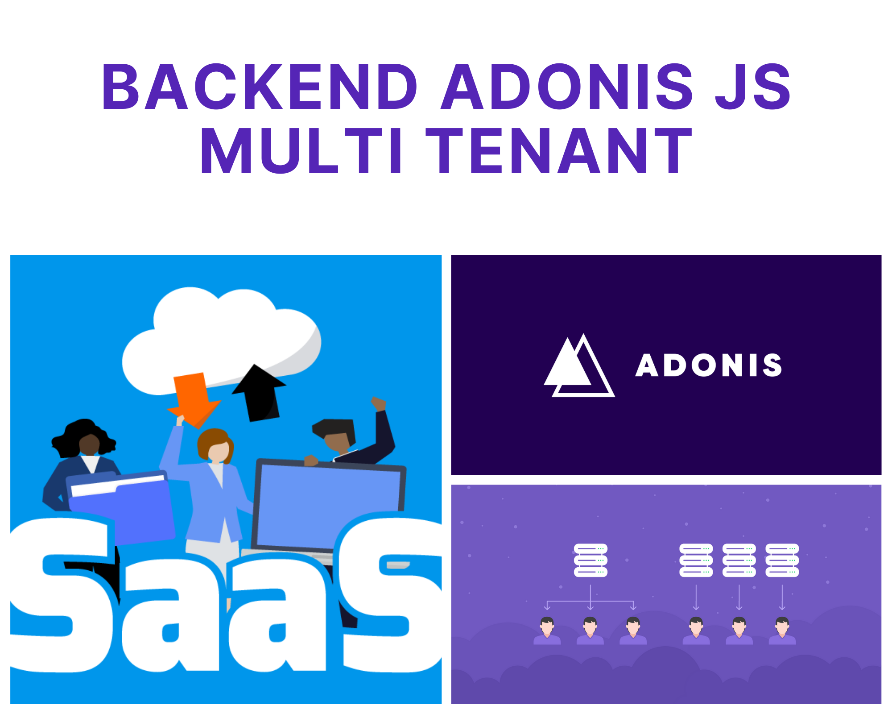

# Curso AdonisJS da RocketSeat - Skylab

Projeto de Backend SaaS construído com AdonisJS 4, utilizando uma arquitetura de desenvolvimento Multi Tenant.

  

Abaixo segue o link da plataforma de cursos Skylab, onde este projeto faz parte do Curso Bônus de Backend.
https://skylab.rocketseat.com.br/

### Adonis API application

This is the boilerplate for creating an API server in AdonisJs, it comes pre-configured with.

1. Bodyparser
2. Authentication
3. CORS
4. Lucid ORM
5. Migrations and seeds
